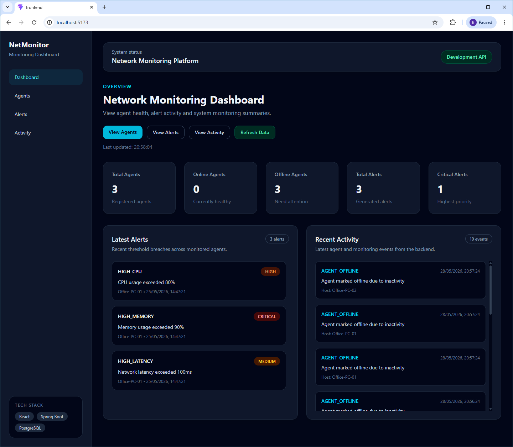
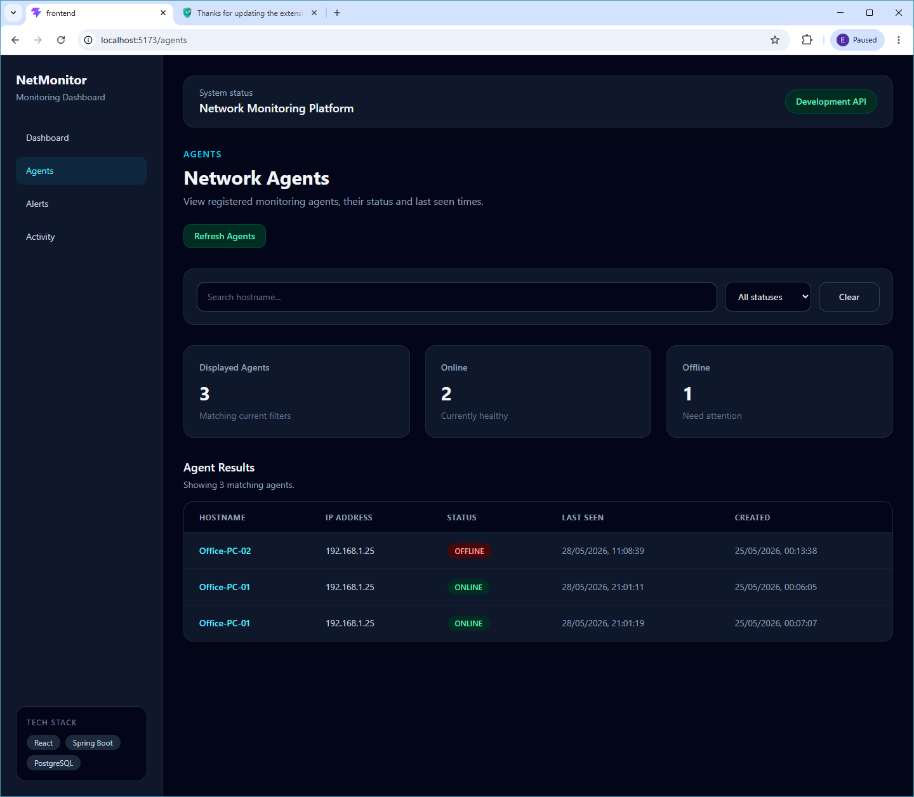
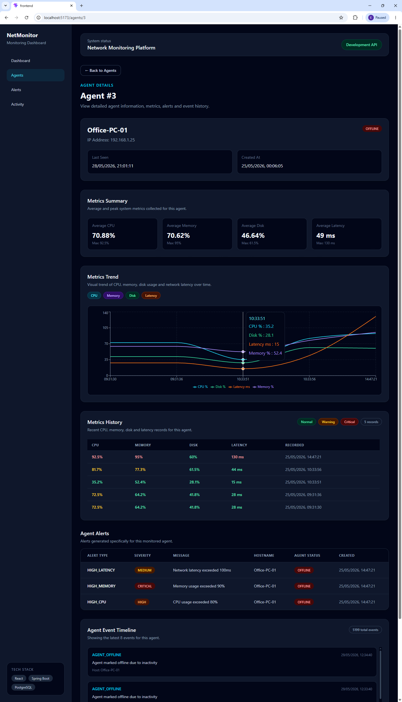
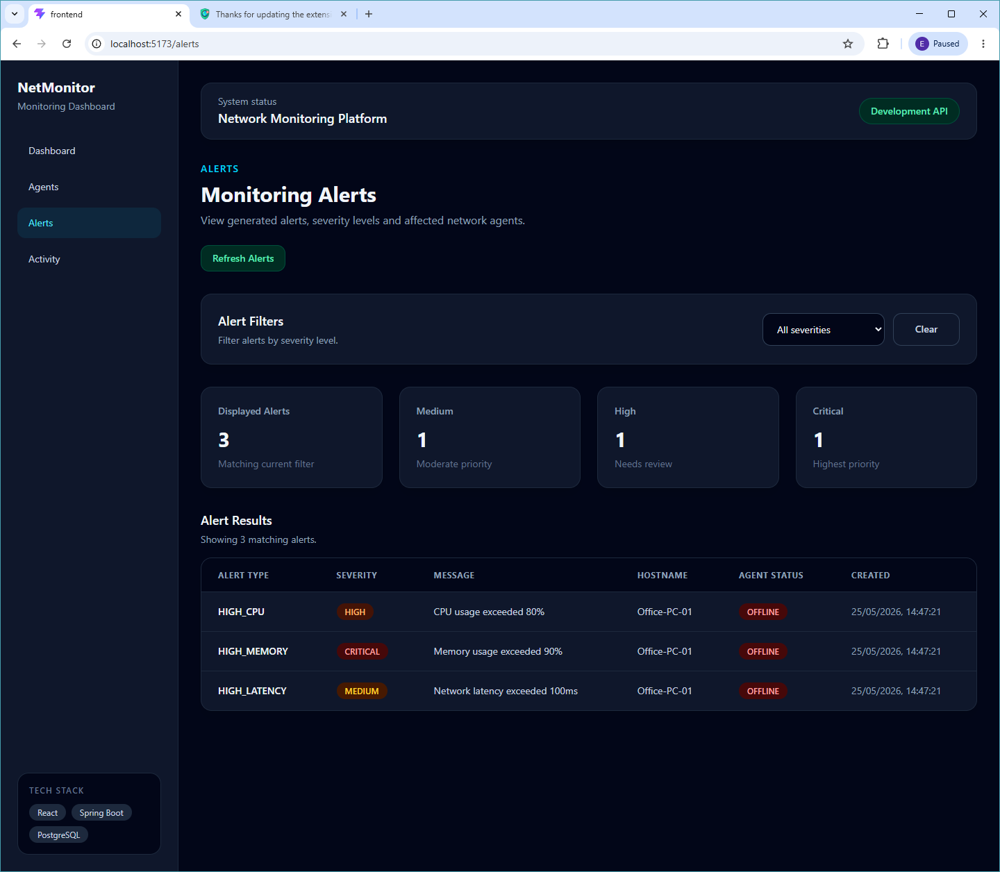
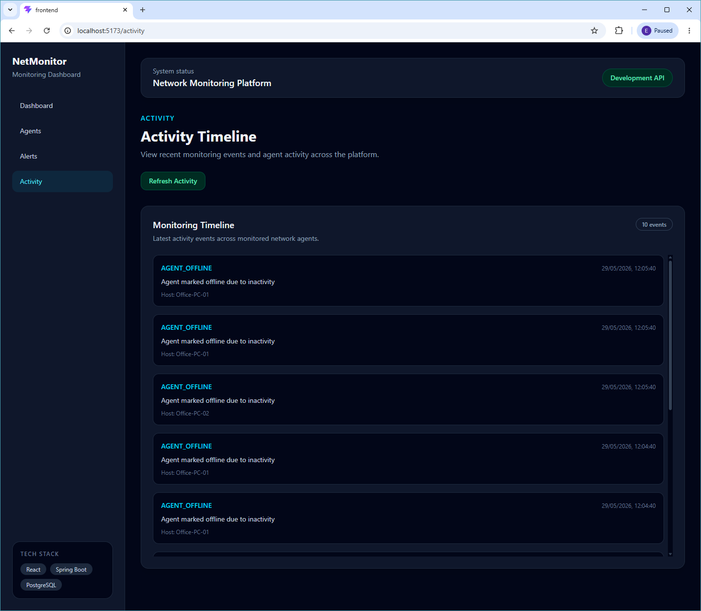

# Network Monitoring Platform

A backend monitoring platform built with Spring Boot and PostgreSQL that simulates real-time network monitoring behaviour. The system tracks agents, records activity events, collects system metrics, generates alerts, and provides dashboard analytics through REST APIs.

## Features

### Agent Management
- Create, retrieve and delete network agents
- Search agents by hostname and status
- Track ONLINE/OFFLINE state

### Heartbeat Monitoring
- Heartbeat endpoint for agent check-ins
- Automatic `lastSeen` updates
- Agent status recovery through heartbeat updates

### Automated Monitoring
- Scheduled background task for inactive agents
- Automatic OFFLINE detection after inactivity

### Event Logging
- Stores historical activity events
- Agent-specific event timelines
- Recent activity feed

### System Metrics
- CPU usage monitoring
- Memory usage monitoring
- Disk usage monitoring
- Network latency tracking
- Timestamped metric history

### Analytics
- Average metric calculations
- Maximum metric calculations
- Dashboard summary statistics

### Alert System
- HIGH_CPU alerts
- HIGH_MEMORY alerts
- HIGH_LATENCY alerts
- Severity levels (HIGH / CRITICAL / MEDIUM)

### API Improvements
- DTO-based responses
- Global exception handling
- Custom error responses

---

## Tech Stack

### Backend
- Java 21
- Spring Boot
- Spring Data JPA
- Hibernate
- Gradle

### Database
- PostgreSQL 16
- Docker Compose

### Development Tools
- IntelliJ IDEA
- Postman
- Git/GitHub

---

## Project Architecture

```text
Controller
     ↓
Service
     ↓
Repository
     ↓
PostgreSQL Database
```

---

## API Endpoints

### Agents

```http
POST   /api/agents
GET    /api/agents
GET    /api/agents/{id}
DELETE /api/agents/{id}
GET    /api/agents/search
PUT    /api/agents/{id}/heartbeat
```

### Events

```http
GET /api/events
GET /api/events/agent/{id}
```

### Metrics

```http
POST /api/metrics/agent/{id}
GET  /api/metrics/agent/{id}
GET  /api/metrics/agent/{id}/summary
```

### Alerts

```http
GET /api/alerts
GET /api/alerts/agent/{id}
```

### Dashboard

```http
GET /api/dashboard/summary
```

### Activity Feed

```http
GET /api/activity/recent
```

---

## Frontend Dashboard

A React frontend dashboard has been added to provide a portfolio-ready interface for viewing monitoring data from the Spring Boot API.

### Frontend Tech Stack

- React
- Vite
- Tailwind CSS
- Axios
- React Router
- Recharts

### Frontend Features

- Dashboard overview with agent and alert summary cards
- Latest alerts and recent activity preview panels
- Agents page with hostname search and status filtering
- Agent details page with profile data, metrics summary, metrics history, alerts and event timeline 
- Metrics trend chart for CPU, memory, disk and latency visualisation
- Alerts page with severity filtering and summary cards
- Activity timeline page for recent monitoring events
- Reusable loading and error states
- Polished 404 page for invalid routes
- Environment-based API configuration for deployment readiness

### Frontend Setup

Navigate to the frontend folder:

```bash
cd frontend
```

Install dependencies:

```bash
npm install
```

Create a `.env` file inside the `frontend` folder:

```env
VITE_API_BASE_URL=http://localhost:8080/api
```

An example file is provided at:

```text
frontend/.env.example
```

Run the frontend locally:

```bash
npm run dev
```

The frontend will start at:

```text
http://localhost:5173
```

Build the frontend for production:

```bash
npm run build
```

---

### Screenshots

#### Dashboard Overview



#### Agents Page



#### Agent Details Drill-Down



#### Alerts Page



#### Activity Timeline



---

## Future Improvements

- Authentication with Spring Security + JWT
- WebSocket live updates
- Charts for metrics visualisation
- Deployment to cloud infrastructure
- Real agent monitoring clients
- Public live demo for recruiters